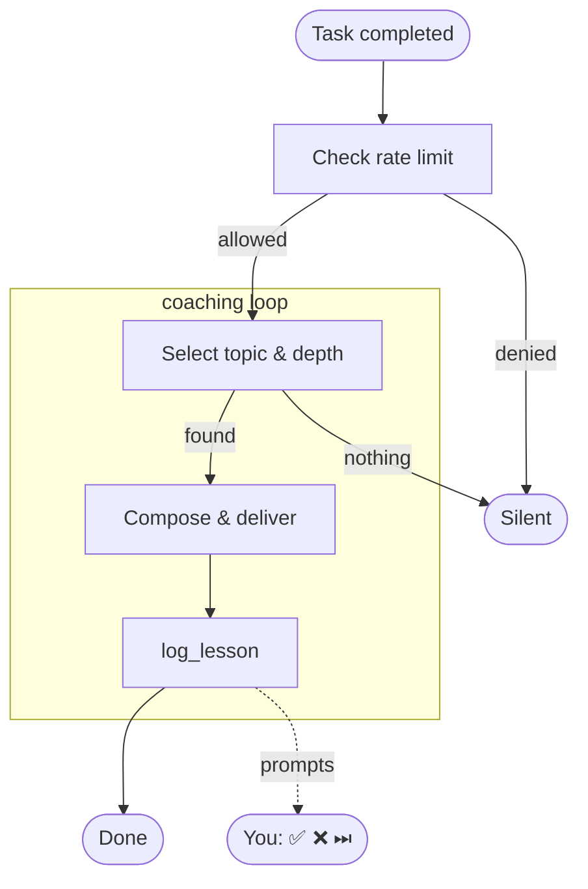

# devcoach

[](https://pypi.org/project/devcoach/)
[](https://pypi.org/project/devcoach/)
[](https://github.com/UltimaPhoenix/dev-coach/actions/workflows/ci.yml)
[](https://sonarcloud.io/summary/new_code?id=UltimaPhoenix_dev-coach)
[](https://sonarcloud.io/summary/new_code?id=UltimaPhoenix_dev-coach)
[](https://ultimaphoenix.github.io/dev-coach/)
[](LICENSE)

**Progressive technical coaching that lives inside your AI agent.** devcoach connects to Claude Code, Cursor, Windsurf, and other MCP-compatible tools. After every task you complete, it delivers a short targeted lesson calibrated to what you already know — no generic tutorials, no repeated topics, nothing to open.

Everything runs **locally**. No data leaves your machine. One SQLite file at `~/.devcoach/coaching.db`.

---

## How it works



→ [Full decision flow: session startup · lesson selection · depth calibration](https://ultimaphoenix.github.io/dev-coach/how-it-works/)

---

## Get started in 2 steps

### Step 1 — Install

| Method | Command | Requirements |
|--------|---------|--------------|
| **Homebrew** (recommended) | `brew tap UltimaPhoenix/tap && brew install devcoach` | macOS / Linux |
| **uv tool** | `uv tool install devcoach` | [uv](https://docs.astral.sh/uv/) + Python 3.12+ |
| **uvx** (no install) | _(used directly in MCP config)_ | [uv](https://docs.astral.sh/uv/) + Python 3.12+ |

### Step 2 — Connect to your AI agent

```bash
devcoach install
```

This registers devcoach as an MCP server and sets up automatic lesson delivery. Restart your agent after running.

<details>
<summary><strong>Connect to other agents</strong> (Cursor, Windsurf, Cline, Continue, Zed…)</summary>

Add this to your agent's MCP config file:

```json
{
  "mcpServers": {
    "devcoach": {
      "command": "devcoach",
      "args": ["mcp"]
    }
  }
}
```

Use `"command": "uvx", "args": ["devcoach", "mcp"]` if using uvx.

| Agent | Config file |
|-------|-------------|
| **Cursor** | `~/.cursor/mcp.json` |
| **Windsurf** | `~/.codeium/windsurf/mcp_config.json` |
| **Cline** (VS Code) | VS Code Settings → `cline.mcpServers` |
| **Continue.dev** | `~/.continue/config.json` → `mcpServers` |
| **Zed** | `.zed/settings.json` → `context_servers` |

> Stop hooks (automatic lesson delivery after each task) are Claude Code-specific. Other agents have full access to all MCP tools and resources — coaching can be triggered manually or by prompting your agent.

</details>

<details>
<summary><strong>Manual setup</strong> (if <code>devcoach install</code> is not available)</summary>

#### Claude Code

**Option A — via `claude mcp` CLI (recommended):**

```bash
# Homebrew or uv tool (devcoach on PATH)
claude mcp add devcoach devcoach -- mcp

# uvx
claude mcp add devcoach uvx -- devcoach mcp

# global scope (all projects)
claude mcp add --scope global devcoach devcoach -- mcp
```

**Option B — edit `~/.claude.json` directly:**

```json
// Homebrew or uv tool
{ "mcpServers": { "devcoach": { "type": "stdio", "command": "devcoach", "args": ["mcp"] } } }

// uvx
{ "mcpServers": { "devcoach": { "type": "stdio", "command": "uvx", "args": ["devcoach", "mcp"] } } }
```

Then add the Stop hooks to `~/.claude/settings.json`:

```json
{
  "hooks": {
    "Stop": [
      { "hooks": [{ "type": "command", "command": "devcoach onboard-hook" }] },
      { "hooks": [{ "type": "command", "command": "devcoach lesson-ready" }] }
    ]
  }
}
```

Replace `devcoach` with `uvx devcoach` in the hook commands if using uvx.

#### Claude Desktop

Edit the config file for your platform:

| Platform | Config file |
|----------|-------------|
| macOS | `~/Library/Application Support/Claude/claude_desktop_config.json` |
| Windows | `%APPDATA%\Claude\claude_desktop_config.json` |
| Linux | `~/.config/Claude/claude_desktop_config.json` |

```json
{
  "mcpServers": {
    "devcoach": {
      "command": "devcoach",
      "args": ["mcp"]
    }
  }
}
```

Use `"command": "uvx", "args": ["devcoach", "mcp"]` if using uvx.

#### Claude.ai web (skill copy)

Claude.ai does not support MCP servers. Install the coaching instructions as a skill instead:

1. Copy the content of [`src/devcoach/SKILL.md`](src/devcoach/SKILL.md)
2. Go to **claude.ai → Settings → Custom instructions** (or Skills, depending on your plan)
3. Paste the content and save

This gives claude.ai the coaching behaviour without the MCP tools (lesson logging and profile tracking will not work).

> **Keep the skill up to date.** For Claude Code / Claude Desktop, the skill is served automatically via the MCP prompt and is always current. If you copied it manually to Claude.ai, re-paste the latest `SKILL.md` after each devcoach update.

</details>

---

## Onboarding

The first time your agent connects to devcoach it detects that your profile isn't set up and walks you through it inline — no separate command needed.

### Phase 1 — Choose how to set up your profile

```
devcoach: Your knowledge profile isn't set up yet.

Do you have an existing devcoach backup to restore?
If yes, provide the file path — otherwise I'll help you build your profile from scratch.
```

**Option A — restore from backup:** If you're on a new machine or reinstalling, provide the path to your backup zip and your full profile (knowledge map, lessons, settings) is imported instantly.

**Option B — build from scratch:** Choose between automatic detection or a guided conversation.

---

### Phase 2 — Build your profile

#### Automatic (recommended)

devcoach scans your project files and proposes your stack:

```
I detected these technologies in your project:

  python         → confidence 6  (keep? or enter 0–10 to adjust)
  docker         → confidence 7  (keep? or enter 0–10 to adjust)
  github_actions → confidence 6  (keep? or enter 0–10 to adjust)
  fastapi        → confidence 5  (keep? or enter 0–10 to adjust)

Anything I missed? List any tools, languages, or practices you work with regularly.
```

You confirm, adjust scores, or add topics the scan missed. Then devcoach proposes logical groups:

```
Here's how I'd organise these:

  Languages  → python, typescript
  Backend    → fastapi, django
  DevOps     → docker, github_actions
  Databases  → postgresql, redis

Does this look right? Any changes?
```

#### Guided conversation

If you prefer to describe your stack manually:

```
devcoach: Tell me about the technologies you work with day-to-day.
          For each one I'll ask how confident you are:
          1–3 = still learning · 4–6 = comfortable · 7–9 = strong · 10 = expert

You: I mostly do Node.js and TypeScript backend, some React, PostgreSQL, Docker.
     I've been doing this for about 3 years.

devcoach: Got it. Let me go through each:

  Node.js — you said you mostly work in it. I'd say 7. Sound right?
  TypeScript — comfortable or strong?
  React — how often do you use it?
  PostgreSQL — do you write raw SQL or mostly ORM?
  Docker — day-to-day or just deployment?
```

---

### Phase 3 — Profile saved, coaching begins

```
✓ Profile saved — 24 topics across 6 groups.

From now on I'll deliver a short lesson after technical tasks,
calibrated to your current confidence on each topic.
```

That's it. You go back to work. Coaching happens silently in the background.

---

## Your first lesson

You work on a task as normal. After Claude responds, devcoach appends a lesson:

```
You: Refactor this endpoint to handle concurrent requests properly.

Claude: [refactors the code, explains the changes]

---
🎓 devcoach · Python · Level: Mid

**asyncio.TaskGroup — structured concurrency without gather() surprises**

asyncio.gather() swallows exceptions from sibling tasks by default. If one
coroutine fails, the others keep running and the exception is only raised after
all of them complete — or silently dropped if return_exceptions=True.

TaskGroup (Python 3.11+) is the fix: it cancels all sibling tasks the moment
one raises, and re-raises immediately. No silent failures, no leaked coroutines.

    async with asyncio.TaskGroup() as tg:
        task_a = tg.create_task(fetch_user(user_id))
        task_b = tg.create_task(fetch_orders(user_id))
    # Both completed or both cancelled — no in-between.

Use gather() only when you explicitly want independent tasks that shouldn't
cancel each other on failure. TaskGroup is the right default for coordinated work.

💡 Senior tip: TaskGroup also makes it trivial to collect results — just read
   task.result() after the block, no zip() gymnastics needed.

Did that land?  ✅ know · ❌ don't know · ⏭ skip
```

Responding adjusts your confidence on that topic and shapes future lessons.

---

## Screenshots

|                       Knowledge map                       | Lesson history | Settings |
|:---------------------------------------------------------:|:---:|:---:|
|  |  |  |

---

## Web dashboard

Open the dashboard at any time to review your progress, edit your profile, or manage settings:

```bash
devcoach ui   # → http://localhost:7860
```

| Page | What you can do |
|------|-----------------|
| **Knowledge map** | See all topics with confidence bars; adjust scores directly |
| **Lessons** | Browse and filter your full lesson history; star lessons to revisit |
| **Settings** | Change rate limits, import/export your profile, take a backup |

Full reference: [docs/web-ui.md](docs/web-ui.md)

---

## Documentation

| Document | Description |
|----------|-------------|
| [Getting started](docs/getting-started.md) | Installation, onboarding, first lesson |
| [Web UI](docs/web-ui.md) | Dashboard pages and controls |
| [CLI reference](docs/cli.md) | All commands with examples |
| [MCP server reference](docs/mcp-server.md) | Tools, resources, data models |
| [Configuration](docs/configuration.md) | Rate limits, data location, schema, backup |

---

## CLI reference

The CLI is a secondary interface for querying and managing your coaching data. Everything is also available in the [web dashboard](#web-dashboard).

| Command | Description |
|---------|-------------|
| `devcoach install` | Register with Claude Code / Claude Desktop |
| `devcoach profile` | Show your knowledge map with confidence bars |
| `devcoach stats` | Overview: lesson counts, weakest/strongest topics |
| `devcoach lessons` | Browse lesson history with filters |
| `devcoach lesson <id>` | Show a single lesson in full |
| `devcoach star <id>` | Mark a lesson as starred |
| `devcoach feedback <id> <know\|dont_know\|clear>` | Record comprehension |
| `devcoach set max_per_day <n>` | Max lessons per day (default 2) |
| `devcoach set min_gap_minutes <n>` | Minutes between lessons (default 240) |
| `devcoach backup [file.zip]` | Export knowledge + lessons + settings |
| `devcoach restore <file.zip>` | Restore from a backup |
| `devcoach setup` | Run the onboarding wizard in the terminal |
| `devcoach ui` | Open the web dashboard |

Full reference: [docs/cli.md](docs/cli.md)

---

## Configuration

```bash
devcoach set max_per_day 3        # up to 3 lessons per day
devcoach set min_gap_minutes 120  # at least 2 hours between lessons
```

Settings are stored in `~/.devcoach/coaching.db`. See [docs/configuration.md](docs/configuration.md) for all options.

---

## Uninstallation

**1. Remove the binary**

```bash
brew uninstall devcoach && brew untap UltimaPhoenix/tap   # Homebrew
uv tool uninstall devcoach                                  # uv tool
# uvx: nothing to remove
```

**2. Remove from Claude Code**

```bash
claude mcp remove devcoach
```

Or manually remove the `devcoach` entry from `~/.claude.json` → `mcpServers` and the two hook entries from `~/.claude/settings.json` → `hooks.Stop`.

**3. Remove from Claude Desktop**

Edit the platform config file (paths in the [Manual setup](#manual-setup-if-devcoach-install-is-not-available) section above) and delete the `devcoach` key from `mcpServers`.

**4. Delete all devcoach data**

```bash
rm -rf ~/.devcoach
```

This removes the coaching database, knowledge map, lessons, settings, and notebook. Take a backup first if needed (`devcoach backup`).

---

## Publishing a new release

Tag a commit with `v*` to trigger the CI/CD pipeline:

```bash
git tag v1.2.3
git push origin v1.2.3
```

The pipeline will lint, test across Python 3.12–3.13, build, publish to PyPI via OIDC Trusted Publishing, and create a GitHub Release automatically.

> **First-time PyPI setup:** configure a Trusted Publisher on PyPI for `UltimaPhoenix/dev-coach` (environment: `pypi`, workflow: `ci.yml`). No API token required after that.

---

## License

Copyright 2026 [UltimaPhoenix](https://github.com/UltimaPhoenix)

Licensed under the [Apache License, Version 2.0](LICENSE).

**What this means for you:**

- Free to use, modify, and distribute
- **Commercial use and modifications must:**
  - Include a copy of this license
  - State any changes made to the files
  - Retain all copyright and attribution notices
  - Include the `NOTICE` file in any derivative distribution
- You may **not** use the `devcoach` name or branding to endorse derived products without permission

See [NOTICE](NOTICE) for third-party attributions.
