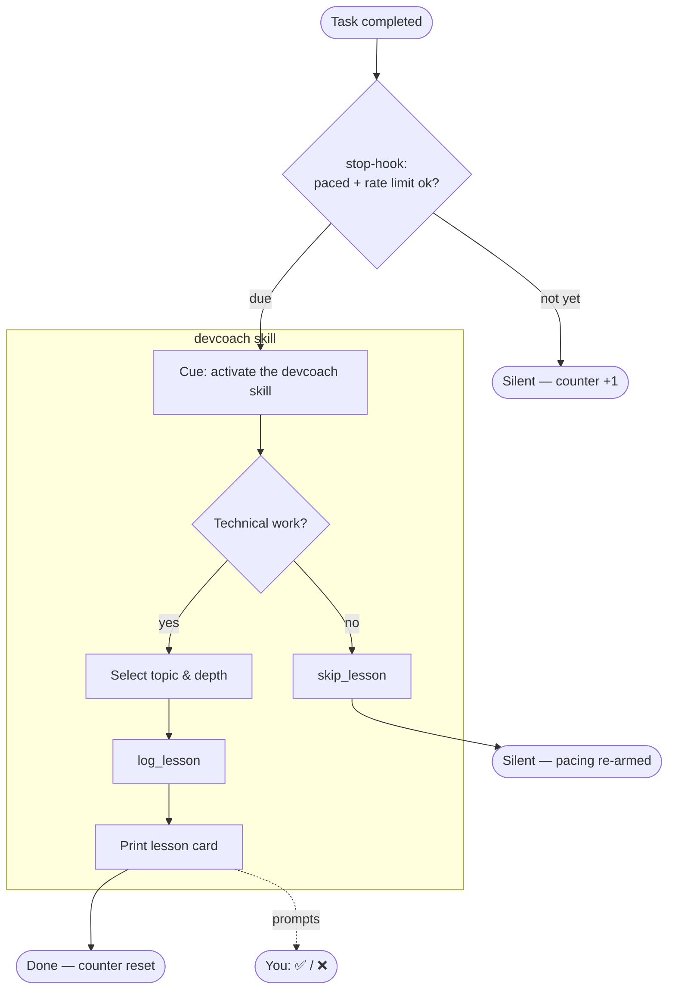
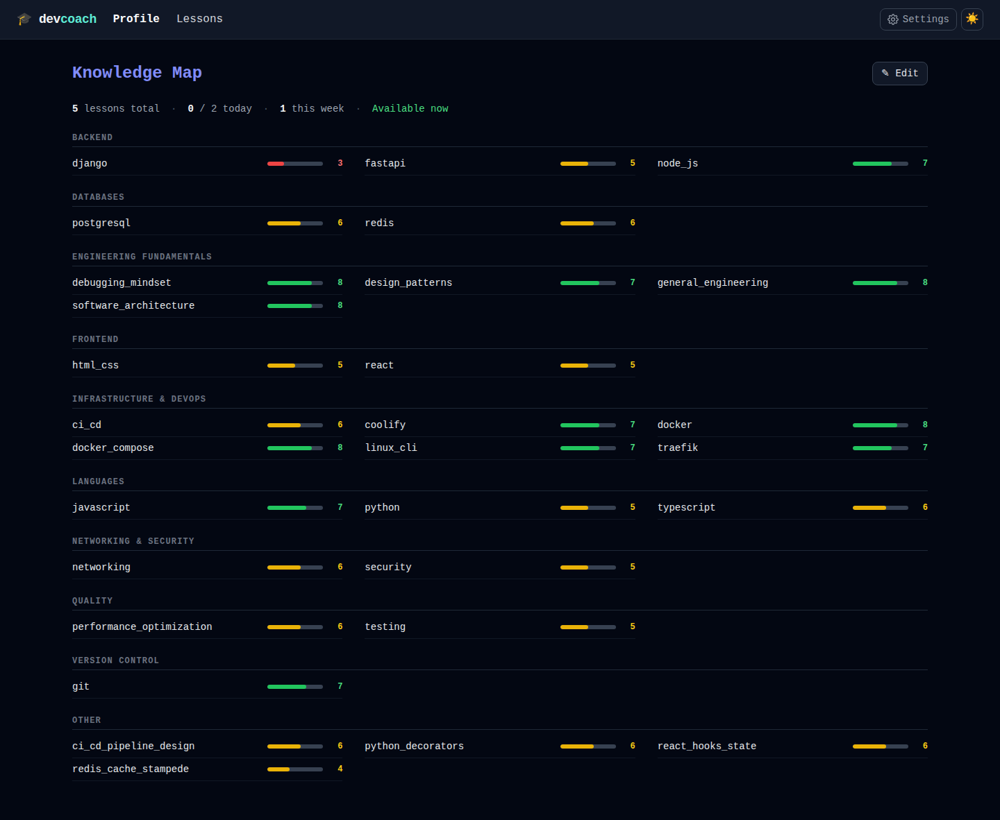
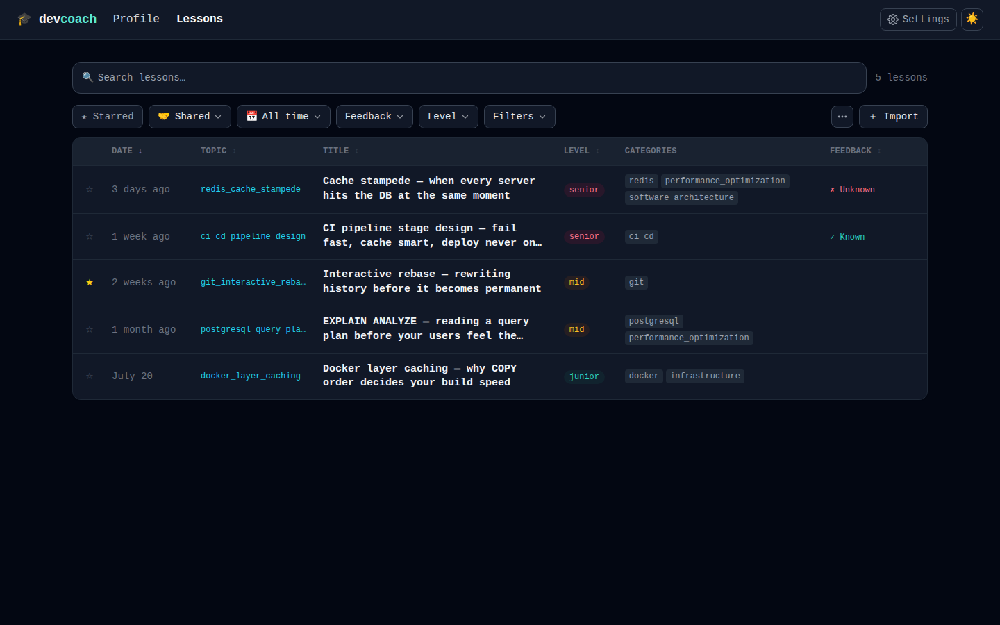
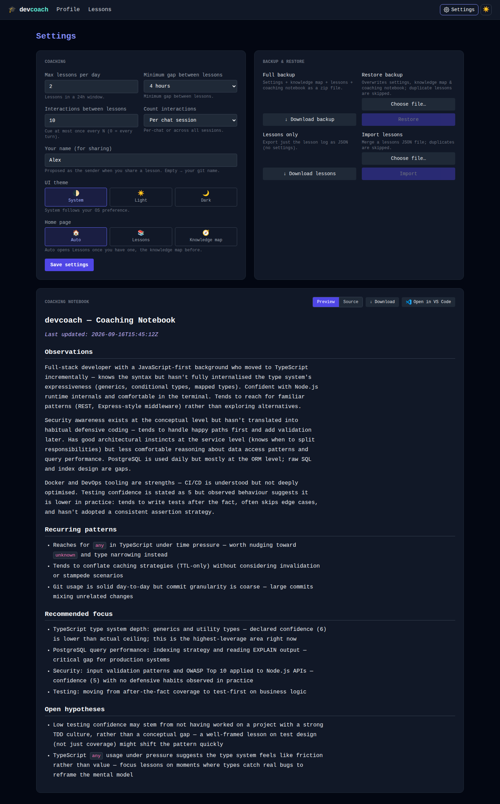

# devcoach

<p align="center">
  <a href="https://ultimaphoenix.github.io/dev-coach/">
    
  </a>
</p>

[](https://www.npmjs.com/package/devcoach)
[](https://github.com/UltimaPhoenix/dev-coach/actions/workflows/ci.yml)
[](https://sonarcloud.io/summary/new_code?id=UltimaPhoenix_dev-coach)
[](https://sonarcloud.io/summary/new_code?id=UltimaPhoenix_dev-coach)
[](https://nodejs.org/)
[](https://ultimaphoenix.github.io/dev-coach/)
[](LICENSE)

**Stay sharp while your AI does the work.**

devcoach connects to Claude Code, Claude Desktop, Gemini CLI *(beta)*, Codex CLI *(beta)*, Cursor, Windsurf, and other MCP-compatible tools. After every task you complete, it delivers a short targeted lesson calibrated to what you already know — no generic tutorials, no repeated topics, nothing to open.

Everything runs **locally**. No data leaves your machine. One SQLite file at `~/.devcoach/coaching.db`.

> Built on the official [Model Context Protocol TypeScript SDK](https://github.com/modelcontextprotocol/typescript-sdk), Node's embedded `node:sqlite`, [Hono](https://hono.dev) (web dashboard), and [Commander](https://github.com/tj/commander.js) (CLI). Requires **Node.js ≥ 24**.

---

## Why devcoach?

AI agents now write much of our code — which makes it easy to ship more while understanding less. devcoach turns each task your agent finishes into one short, in-context lesson, so you keep learning as you go. The deeper bet: as AI grows more capable, the scarce skill becomes *validating* what it produces — and that ability only survives if you keep practicing it.

→ [Why devcoach exists](docs/why.md)

---

## How it works


```mermaid
flowchart TD
    A([Task completed]) --> B{"stop-hook:<br/>paced + rate limit ok?"}
    B -->|not yet| Z(["Silent — counter +1"])
    B -->|due| C["Cue: activate the devcoach skill"]

    subgraph skill["devcoach skill"]
        C --> D{"Technical work?"}
        D -->|no| S[skip_lesson]
        D -->|yes| E[Select topic & depth]
        E --> G[log_lesson]
        G --> F[Print lesson card]
    end

    S --> Y(["Silent — pacing re-armed"])
    F --> H(["Done — counter reset"])
    F -.->|prompts| U(["You: ✅ / ❌"])
```

→ [Full decision flow: session startup · lesson selection · depth calibration](docs/how-it-works.md)

---

## Privacy by design

Everything stays on your machine. No telemetry, no accounts, no calls home. Just one SQLite file.

→ [Privacy & security](docs/reference/privacy.md)

---

## Installation

devcoach runs **locally** — a stdio MCP server that stores everything in `~/.devcoach/coaching.db` on the machine where your agent runs. It works in **Claude Code**, **Claude Desktop**, **Gemini CLI** *(beta)*, and **Codex CLI** *(beta)*, but **not** on claude.ai web (which only supports hosted/remote connectors).

**Requires Node.js ≥ 24** (devcoach uses the embedded `node:sqlite` module, available only from Node 24 onward).

**Pick by how you like to work** — each section is self-contained (install **and** connect):

- **Developer, comfortable in a terminal → [Homebrew](#homebrew-recommended-for-developers)** — one `brew install`, and you get the `devcoach` CLI too.
- **Prefer a one-click, no-terminal setup → the [Claude Code plugin](#claude-code-plugin-recommended-for-claude-code) or the [`.mcpb` extension](#claude-desktop-extension-mcpb-recommended-for-claude-desktop)**.
- **Registry-aware MCP client?** devcoach is listed in the official [MCP Registry](https://registry.modelcontextprotocol.io) as `io.github.UltimaPhoenix/devcoach` — install it straight from there.
- Anything else (npx, manual config, other agents, claude.ai web) is under **[Other install methods](#other-install-methods)**.

### Homebrew (recommended for developers)

macOS / Linux. Add and trust the tap once, install, then connect — you also get the **`devcoach` CLI** (so [`devcoach ui`](#web-dashboard) and the [CLI](docs/usage/cli.md) work without an `npx` prefix):

```bash
# 1. Add the tap — registers github.com/UltimaPhoenix/homebrew-tap with Homebrew
brew tap UltimaPhoenix/tap

# 2. Trust the whole tap — required when Homebrew enforces HOMEBREW_REQUIRE_TAP_TRUST
brew trust --tap UltimaPhoenix/tap

# 3. Install
brew install devcoach

# 4. Connect (Homebrew puts `devcoach` on your PATH — no `npx -y` prefix needed)
devcoach install
```

`brew tap` registers the third-party repository; `brew trust --tap` marks it trusted so Homebrew will load its formulae when `HOMEBREW_REQUIRE_TAP_TRUST` is set. Both are one-time. To update later: `brew upgrade devcoach`. One-liner: `brew install UltimaPhoenix/tap/devcoach` (run `brew trust --tap UltimaPhoenix/tap` first if your Homebrew enforces tap trust). The formula declares `depends_on "node"`, so Homebrew pulls in a recent Node automatically.

### Claude Code plugin (recommended for Claude Code) — **Beta**

The simplest way to add devcoach to **Claude Code** — one click, nothing to configure. It bundles **everything** (MCP server + automatic-coaching Stop hooks + skill), so **don't also run `devcoach install`** (or the Stop hooks get registered twice).

```bash
# Add the marketplace once, then install (you can install any UltimaPhoenix plugin from it later)
/plugin marketplace add UltimaPhoenix/claude-plugins-marketplace
/plugin install devcoach@ultimaphoenix
```

The MCP server, hooks, and skill activate on install — no restart needed. The plugin **does not** add the `devcoach` CLI, so run the dashboard or CLI with `npx -y devcoach ui` (or use Homebrew / `npm i -g devcoach` for a bare `devcoach`).

<details>
<summary><strong>Other ways to install the plugin</strong> (straight from the repo · offline zip)</summary>

```bash
# Straight from the devcoach repo (no separate marketplace)
/plugin marketplace add UltimaPhoenix/dev-coach
/plugin install devcoach@devcoach

# Offline — download devcoach-plugin-<version>.zip from a GitHub Release, unzip, then:
/plugin marketplace add /path/to/unzipped-folder
/plugin install devcoach@devcoach
```

</details>

See [Claude Code plugin](docs/install/claude-code-plugin.md) for how it works.

### Claude Desktop extension (`.mcpb`) (recommended for Claude Desktop) — **Beta**

A single bundle that runs on Claude Desktop's built-in runtime — no Node or terminal needed. Every GitHub Release ships one:

1. Download `devcoach-<version>.mcpb` from the [latest release](https://github.com/UltimaPhoenix/dev-coach/releases/latest)
2. Claude Desktop → **Settings → Extensions → Install Extension…** → pick the `.mcpb`

The bundle is **self-signed**, so Claude Desktop installs it as an *unverified publisher* (a real code-signing cert would be needed for a verified signature). Prefer to build it from source?

```bash
npm run mcpb        # → dist-mcpb/devcoach-<version>.mcpb   (npm run mcpb:sign self-signs it)
```

### Other install methods — **Beta**

<details>
<summary><strong>npx / npm CLI</strong> (any MCP agent — no install)</summary>

No install required — `npx` runs devcoach on demand. For **Claude Code** and **Claude Desktop**, one command registers the MCP server, wires up automatic lesson delivery (Stop hooks), and installs the coaching **skill** into `~/.claude/skills/devcoach/`:

```bash
npx -y devcoach install
```

Restart your agent afterward. Prefer a global binary? `npm install -g devcoach`, then run `devcoach install` (and drop the `npx -y` prefix everywhere). After upgrading devcoach, re-run `devcoach install` to refresh the skill — `devcoach stats` reminds you when it's out of date.

</details>

<details>
<summary><strong>Manual MCP config for Claude Code</strong> (if <code>devcoach install</code> isn't available)</summary>

**Option A — via the `claude mcp` CLI (recommended):**

```bash
claude mcp add devcoach npx -- -y devcoach mcp

# all projects (user scope)
claude mcp add --scope user devcoach npx -- -y devcoach mcp
```

**Option B — edit `~/.claude.json` directly:**

```json
{ "mcpServers": { "devcoach": { "type": "stdio", "command": "npx", "args": ["-y", "devcoach", "mcp"] } } }
```

Then add the hooks to `~/.claude/settings.json` for automatic lesson delivery — `stop-hook` decides
after each turn whether a lesson is due, `prompt-hook` primes the model up front when one is:

```json
{
  "hooks": {
    "Stop": [
      { "hooks": [{ "type": "command", "command": "npx -y devcoach stop-hook", "timeout": 60 }] }
    ],
    "UserPromptSubmit": [
      { "hooks": [{ "type": "command", "command": "npx -y devcoach prompt-hook", "timeout": 30 }] }
    ]
  }
}
```

> Tip: a global install puts `devcoach` on your `PATH`, so you can drop the `npx -y` prefix. `devcoach install` detects this automatically.
> **Using the Claude Code plugin (above)?** Skip the hooks here — the plugin already provides them.

</details>

<details>
<summary><strong>Gemini CLI</strong> — full coaching loop (hooks + skill) — <strong>Beta</strong></summary>

One command registers the MCP server, the `AfterAgent`/`BeforeAgent` lesson hooks, and the coaching skill:

```bash
npx -y devcoach install --gemini
```

Or install the bundled **Gemini extension** instead: download `devcoach-gemini-extension-<version>.zip` from the [latest release](https://github.com/UltimaPhoenix/dev-coach/releases/latest), unzip, then `gemini extensions install <folder>`. Pick **one** of the two (both provide the same hooks; devcoach detects the extension and skips duplicates). Details: [docs/install/gemini-cli.md](docs/install/gemini-cli.md).

</details>

<details>
<summary><strong>Codex CLI</strong> — full coaching loop (hooks + skill) — <strong>Beta</strong></summary>

One command registers the MCP server (`codex mcp add`), the `Stop`/`UserPromptSubmit` lesson hooks (`~/.codex/hooks.json`), and the coaching skill (`~/.agents/skills/`):

```bash
npx -y devcoach install --codex
```

Codex asks you to **trust** the new hooks once on the next run — approve them or coaching stays inert. Details: [docs/install/codex.md](docs/install/codex.md).

</details>

<details>
<summary><strong>Other MCP agents</strong> (Cursor, Windsurf, Cline, Continue, Zed…)</summary>

Add this to your agent's MCP config file (or, if your client browses the [MCP Registry](https://registry.modelcontextprotocol.io), install `io.github.UltimaPhoenix/devcoach` from there):

```json
{
  "mcpServers": {
    "devcoach": {
      "command": "npx",
      "args": ["-y", "devcoach", "mcp"]
    }
  }
}
```

| Agent | Config file |
|-------|-------------|
| **Cursor** | `~/.cursor/mcp.json` |
| **Windsurf** | `~/.codeium/windsurf/mcp_config.json` |
| **Cline** (VS Code) | VS Code Settings → `cline.mcpServers` |
| **Continue.dev** | `~/.continue/config.json` → `mcpServers` |
| **Zed** | `.zed/settings.json` → `context_servers` |

> Stop hooks (automatic lesson delivery after each task) exist for Claude Code, Gemini CLI, and Codex CLI. The agents in this table have full access to all MCP tools and resources — coaching can be triggered manually or by prompting your agent.

</details>

<details>
<summary><strong>claude.ai web</strong> (skill copy — no MCP)</summary>

Claude.ai does not support MCP servers. Install the coaching instructions as a skill instead:

1. Copy the content of [`assets/SKILL.md`](assets/SKILL.md)
2. Go to **claude.ai → Settings → Custom instructions** (or Skills, depending on your plan)
3. Paste the content and save

This gives claude.ai the coaching behaviour without the MCP tools (lesson logging and profile tracking will not work).

> **Keep the skill up to date.** For Claude Code / Claude Desktop, the skill is served automatically (via the MCP prompt or the plugin) and is always current. If you copied it manually to claude.ai, re-paste the latest `SKILL.md` after each devcoach update.

</details>

---

## Onboarding

The first time your agent connects to devcoach it detects that your profile isn't set up and walks you through it inline — no separate command needed. (Prefer the terminal? `devcoach setup` runs the same wizard.)

→ [Full onboarding walkthrough](docs/usage/coaching.md)

### Phase 1 — Choose how to set up your profile

devcoach scans your **full local Claude Code history** (every project the agent has worked in, ranked by recent activity — file and activity metadata only, never prompt text) and offers four ways to build the profile:

```
devcoach: Your knowledge profile isn't set up yet. I scanned 9 of your Claude Code
projects and found TypeScript (dev-coach), Java (discordbot), Swift (blueprince).

  1. Automatic (strongly recommended) — build the profile from that, no questions asked
  2. Automatic (Deep)   — also read my local session transcripts for a sharper profile
  3. Guided             — a step-by-step conversation about my stack
  4. Import backup      — restore a devcoach backup zip
```

### Phase 2 — Build your profile

#### Automatic (strongly recommended)

Builds the whole profile — topics, confidence scores, groups, and the coaching notebook — in **one pass** from the stack detected across your history. No questions: you review and adjust the result afterwards (in chat, with the CLI, or in the dashboard).

#### Automatic (Deep)

Opt-in. Everything Automatic does, plus a separate subagent reads the **real conversation text** of your local Claude Code session transcripts (`~/.claude/projects/`) for the most accurate profile and notebook it can produce. A metadata-only pre-check runs first over a rolling 3-month window; if it finds more than 8 projects, devcoach asks whether to narrow the window, proceed with the 25 most recent, or pick specific projects. The agent says so up front: this shares more of your own local history with the model than the metadata scan does — once, on this machine, as a setup step.

#### Guided

Prefer to describe your stack yourself? devcoach asks about each technology and your confidence level (1–3 still learning · 4–6 comfortable · 7–9 strong · 10 expert), agrees the topic groups with you, then saves the profile.

#### Import backup

On a new machine or reinstalling? Provide the path to your backup zip and your full profile — knowledge map, lessons, settings, and notebook — is restored instantly.

### Phase 3 — Profile saved, coaching begins

After saving, your agent shows what was set up, grouped the way your knowledge map is organised — for the Automatic modes this is your first look at it, so it's the moment to ask for changes:

```
✓ Profile saved — 24 topics across 6 groups.

### Languages
- **typescript** — 7/10
- **java** — 5/10

### DevOps
- **docker** — 7/10
- **github_actions** — 6/10

### Other
- **regex** — 4/10

Change any of this later in chat ("set my Java confidence to 7"), with the
`devcoach` CLI, or in `devcoach ui`.
```

That's it. You go back to work. Coaching happens silently in the background.

---

## Your first lesson

You work on a task as normal. After your agent responds, devcoach appends a lesson:

```
You: Refactor this endpoint to handle concurrent requests properly.

Agent: [refactors the code, explains the changes]

### ──────── 🎓 devcoach ────────
**Promise.allSettled vs Promise.all — don't let one failure sink the batch** · TypeScript · Mid

Promise.all rejects the moment any promise rejects, and you lose the results of
the ones that already succeeded. For independent work (fan-out fetches, batch
writes) that's usually the wrong default.

Promise.allSettled always resolves, giving you a status for every promise:

    const results = await Promise.allSettled(ids.map(fetchUser));
    const ok = results.filter(r => r.status === "fulfilled").map(r => r.value);

Use Promise.all when the tasks are genuinely all-or-nothing; reach for
allSettled when partial success is meaningful and you want to report failures.

💡 *Senior tip:* for coordinated work that *should* cancel siblings on failure,
an AbortController shared across the requests gives you all-or-nothing with
prompt cancellation — the structured-concurrency middle ground.
### ──────── typescript · mid ────────

Did that land? ✅ know (y) · ❌ don't know (n)
```

Reply `y` or `n` (or ✅ / ❌) to adjust your confidence on that topic and shape future lessons — or just move on: no reply means no change.

---

## Screenshots

|                       Knowledge map (personalize here)                       | Lesson history | Settings |
|:---------------------------------------------------------:|:---:|:---:|
|  |  |  |

---

## Context & personalization

Every lesson stores **where it happened** — your project folder, repository, branch, commit hash, editor. You can also personalize your coaching with a **learning notebook** at `~/.devcoach/learning-state.md` that shapes which topics devcoach prioritises and how deep the lessons go.

→ [The coaching notebook](docs/index.mdx#the-coaching-notebook) · [Web dashboard guide](docs/usage/web-ui.md)

---

## Web dashboard

Open the dashboard at any time to review your progress, edit your profile, or manage settings:

```bash
npx -y devcoach ui   # → http://localhost:7860
```

| Page | What you can do |
|------|-----------------|
| **Knowledge map** | See all topics with confidence bars; adjust scores directly |
| **Lessons** | Browse and filter your full lesson history; star lessons to revisit |
| **Settings** | Change rate limits, import/export your profile, take a backup |

Full reference: [docs/usage/web-ui.md](docs/usage/web-ui.md)

---

## CLI reference

The CLI is a secondary interface for querying and managing your coaching data. Everything is also available in the [web dashboard](#web-dashboard). Run `devcoach --help` or `devcoach <command> --help` for full usage.

| Command | Description |
|---------|-------------|
| `devcoach install` | Register with Claude Code (MCP + hooks + skill) / Claude Desktop |
| `devcoach profile` | Show your knowledge map with confidence bars |
| `devcoach stats` | Overview: lesson counts, weakest/strongest topics |
| `devcoach lessons` | Browse lesson history with filters |
| `devcoach lesson <id>` | Show a single lesson in full |
| `devcoach star <id>` | Mark a lesson as starred |
| `devcoach feedback <id> <know\|dont_know\|clear>` | Record comprehension |
| `devcoach set max_per_day <n>` | Max lessons per day (default 2) |
| `devcoach set min_gap_minutes <n>` | Minutes between lessons (default 240) |
| `devcoach backup [file.zip]` | Export knowledge + lessons + settings + notebook |
| `devcoach restore <file.zip>` | Restore from a backup |
| `devcoach setup` | Run the onboarding wizard in the terminal |
| `devcoach ui` | Open the web dashboard |

(Prefix with `npx -y` if you haven't installed globally.) Full reference: [docs/usage/cli.md](docs/usage/cli.md)

---

## Configuration

By default: **up to 2 lessons/day, at least 4 hours apart.** Want more coaching? Want less? Change it.

```bash
devcoach set max_per_day 5           # more lessons per day
devcoach set min_gap_minutes 60      # lessons closer together
```

Or use the [web dashboard](docs/usage/web-ui.md) Settings page. See [docs/reference/configuration.md](docs/reference/configuration.md) for all options.

---

## Expected outcomes

Over a typical work week with 1–2 tasks per day, you'll receive **2–4 lessons aligned to your stack and confidence level.** Each lesson takes 30 seconds to read. After a month of normal AI-assisted development, you'll have built a coaching notebook specific to your gaps — exact patterns you struggle with, edge cases you tend to miss, the reasoning behind tools you reach for instinctively.

**Too intense?** Dial back the frequency: `devcoach set max_per_day 1`. **Want more coaching?** Crank it up: `devcoach set max_per_day 5`. Everything is tunable.

The compounding effect: developers who keep learning while tools get stronger stay in control of the result.

---

## Troubleshooting

**"Node version error"**

devcoach requires Node.js ≥ 24. Check your version: `node --version`. If you're below 24, upgrade: `brew upgrade node` (Homebrew) or `nvm install 24` (if using nvm).

**"MCP server not connecting"**

Run `devcoach install` to re-register the server with Claude Code or Claude Desktop, then restart the agent. If the issue persists, check `~/.claude.json` (Claude Code) and confirm the `devcoach` entry is present and the command is correct.

**"Coaching isn't firing / no lessons appear"**

Run **`devcoach doctor`** — it checks the whole wiring (Node version, hook entries in `~/.claude/settings.json` — plus `~/.gemini/settings.json` and `~/.codex/hooks.json` when present — skill, MCP registration, database, pacing counters, rate limit) and ends with a verdict explaining exactly why the next stop would or wouldn't cue a lesson. Remember that pacing is intentionally quiet: with the defaults a lesson is cued only after `nudge_every` interactions in a session and within the rate limits — that's by design, not a bug. For a live trace, set `DEVCOACH_HOOK_DEBUG=1` and watch `~/.devcoach/hook.log`: every hook run appends one line with its decision (`paced (3/10)`, `rate limited: …`, `cue`). Hooks exist for Claude Code, Gemini CLI *(beta)*, and Codex CLI *(beta)*; other agents (Cursor, Windsurf, Cline) don't support them — coaching is available on demand via MCP tools or manual prompting.

**"Stop hook error occurred" next to a lesson**

That notice is Claude Code's current labeling of *any* Stop hook that blocks — including devcoach's lesson cue (the accompanying "🎓 devcoach…" line tells you it's coaching, not a failure). It's harmless, and by design it's also rare: the UserPromptSubmit priming hook delivers most lessons within the turn, so the blocking fallback only fires when that didn't happen.

**"SQLite permission error"**

devcoach writes to `~/.devcoach/coaching.db`. If you get a permission error, check the directory exists and you have write access: `ls -ld ~/.devcoach`. If missing, run `devcoach install` or `devcoach setup` to initialize it.

---

## Known limitations

- **claude.ai web:** MCP servers are not supported. You can use the [skill copy](docs/install/claude-ai.md) (coaching behaviour only, no data storage).
- **Ephemeral sandboxes:** If your agent runs in a fresh sandbox on each restart (like GitHub Codespaces), devcoach cannot persist data across sessions. It works fine for the current session, but lessons won't carry over.
- **Windows:** devcoach is tested on macOS and Linux. Windows support depends on Node.js ≥ 24 and `node:sqlite` availability (generally solid, but report issues).
- **Multi-user machines:** devcoach writes to `~/.devcoach/`, so each user gets their own coaching database. Profiles are not shared.

---

## Uninstallation

```bash
npm uninstall -g devcoach          # if installed globally (npx: nothing to remove)
brew uninstall devcoach            # if installed via Homebrew (brew untap UltimaPhoenix/tap to drop the tap)
claude mcp remove --scope user devcoach   # remove from Claude Code (install uses user scope)
rm -rf ~/.devcoach                 # delete all coaching data (back up first: devcoach backup)
```

For Claude Desktop, delete the `devcoach` key from the platform config file (paths in **Manual setup** above). Also remove the two hook entries from `~/.claude/settings.json` — one under `hooks.Stop` (`devcoach stop-hook`) and one under `hooks.UserPromptSubmit` (`devcoach prompt-hook`).

---

## Learn more

**Full documentation:** The README is a quick start. For detailed guides, visit the **[official docs](https://ultimaphoenix.github.io/dev-coach/)**:

- **[Why devcoach exists](docs/why.md)** — the philosophy
- **[Coaching in your agent](docs/usage/coaching.md)** — onboarding, your first lesson, the feedback loop
- **[Using the web dashboard](docs/usage/web-ui.md)** — personalise your knowledge map, filter lessons, jump to code context
- **[CLI reference](docs/usage/cli.md)** — all commands for querying and managing data
- **[Installation](docs/install/index.md)** — every install method, agent by agent
- **[Configuration](docs/reference/configuration.md)** — rate limits, pacing, data location, schema
- **[Privacy & security](docs/reference/privacy.md)** — local-first architecture, what is read and stored
- **[How it works](docs/how-it-works.md)** — session startup, coaching loop, lesson selection
- **[Vision & roadmap](docs/vision.md)** — free, local, not commercialized; ideas we're exploring next
- **[Plugin marketplace](docs/install/claude-code-plugin.md#about-the-personal-marketplace)** — UltimaPhoenix plugin collection

---

## Community

- **Star the repo** — help others discover it
- **[GitHub Issues](https://github.com/UltimaPhoenix/dev-coach/issues)** — feature requests, feedback and questions: open an issue

---

## Contributing

Help welcome! See [CONTRIBUTING.md](CONTRIBUTING.md) to get started.

---

## Development

```bash
git clone https://github.com/UltimaPhoenix/dev-coach && cd dev-coach
npm install
npm run dev -- mcp        # run the MCP server from source
npm run dev -- ui         # run the web dashboard from source
npm run lint && npm run typecheck && npm test
npm run build             # tsup → dist/bin.js
npm run mcpb              # build the Claude Desktop .mcpb (npm run mcpb:sign to self-sign)
```

- **MCP Inspector:** `npx @modelcontextprotocol/inspector node dist/bin.js mcp`
- **Stack:** `@modelcontextprotocol/sdk` · `node:sqlite` · Hono · Commander · Zod · Biome · Vitest · tsup

### Publishing a release

Tag a commit with `v*`:

```bash
git tag v1.2.3 && git push origin v1.2.3
```

CI lints, type-checks, tests (Node 24 & 26), builds, and publishes to npm via **OIDC provenance**
(`npm publish --provenance`). First-time setup: configure a Trusted Publisher on npmjs.com for the
`devcoach` package (GitHub Actions, repo `UltimaPhoenix/dev-coach`, workflow `ci.yml`).

---

## License

Copyright (C) 2026 [UltimaPhoenix](https://github.com/UltimaPhoenix)

devcoach is licensed under the [GNU Affero General Public License v3.0](LICENSE) (`AGPL-3.0-only`).
You may use, modify, and distribute it — **provided that any modified version you distribute, or run
as a network service, is also released as open source under the AGPL**. There is **no commercial
license on offer today**; if you genuinely need one — embedding devcoach in a closed-source product
or shipping a proprietary derivative — [open an issue](https://github.com/UltimaPhoenix/dev-coach/issues)
describing your case and it will be considered case by case.

### Licensing FAQ

> **devcoach is and stays 100% free** to download, install, and use — for everyone, forever, including
> at work and on commercial projects. AGPL is *not* a price tag: you only ever pay if you want to ship
> a **proprietary/closed derivative of devcoach itself** without complying with the AGPL.

**Using devcoach does not put your code under the AGPL.** It runs as a separate process over
stdio/MCP (`npx -y devcoach mcp`); talking to it at arm's length is not a derivative work — exactly
like querying an AGPL-licensed database. Your own projects keep whatever license you choose.

- ✅ *"I use devcoach inside Claude Code while building my closed-source startup app."* — Free. Your app stays proprietary, zero obligations.
- ✅ *"My whole team installs devcoach to get coaching on our internal/commercial repos."* — Free. Using the unmodified tool at a company is fine.
- ⚠️ *"I fork devcoach, add a feature, and publish the package or host its dashboard as a public service."* — You must release **your modified devcoach** source under the AGPL.
- 💼 *"I want to embed devcoach in my paid product and keep my changes closed."* — The AGPL doesn't allow that; a commercial license isn't offered today — ask first via an issue.

Keep using devcoach as a tool/executable (not as an imported library) and the AGPL never reaches your own code.
