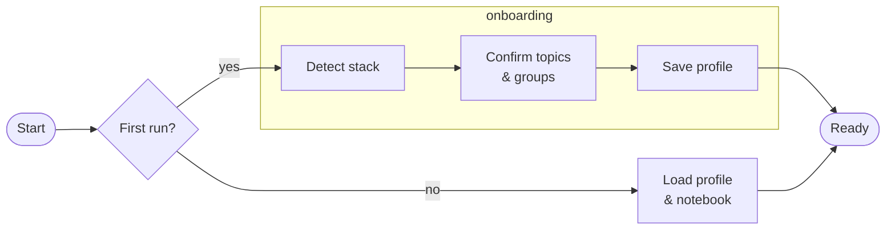
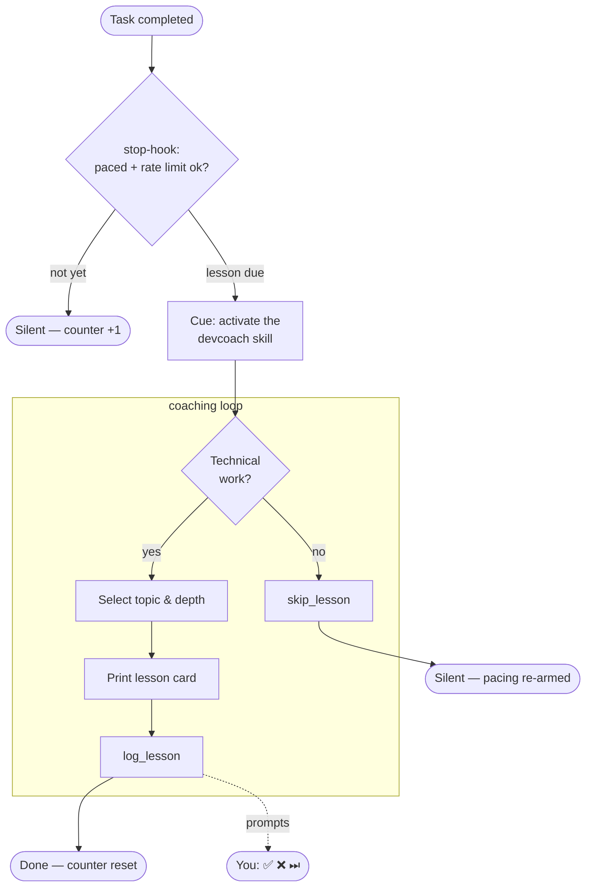

# How it works

devcoach is a silent technical coach that hooks into every Claude response.
The diagrams below show the three main flows: session startup, the coaching loop,
and how a lesson topic is selected.

---

## Session startup

At the start of each Claude session devcoach checks whether the user is set up,
loads prior coaching context, and primes lesson selection before any task is done.

---

## Coaching loop

The loop is driven by two Claude Code hooks. `prompt-hook` (UserPromptSubmit) peeks at
the pacing state and, when a lesson will be due at the end of the turn, primes the model
invisibly so the lesson lands naturally at the bottom of the reply. `stop-hook` (Stop)
owns the pacing counter and is the enforcement: when a lesson is due but wasn't
delivered, it cues the model — which either activates the devcoach skill and delivers
ONE lesson, or declines explicitly via `skip_lesson` (re-arming the pacing) when the
turn wasn't technical. The loop is silent between cues, in plan mode (those turns
don't count), and while rate-limited (turns keep accumulating).

If a cue goes unresolved (no `log_lesson`, no `skip_lesson`), the next cue arrives after
`min(3, nudge_every)` further stops instead of the full threshold. The pre-lesson context
(onboarding status, rate limit, taught topics, profile, notebook) arrives in ONE silent
`devcoach://briefing` read, and the card is printed exactly once: if a lesson was logged
without its card ever becoming visible, the Stop hook detects it from the session
transcript and re-prints the card itself — `log_lesson`'s result deliberately does not
echo it, so the model is never tempted to print it twice.

---

## Lesson selection

When a teachable concept is found, devcoach walks this priority list from top to bottom
and picks the first match. Depth is then calibrated to the per-topic confidence score.

| Priority | Trigger | Condition |
|:---:|---|---|
| ① | Notebook follow-up | The coaching notebook flagged an angle relevant to the current task |
| ② | Profile pitfall | A pitfall committed or avoided on a profile topic |
| ③ | Profile pattern | An interesting pattern on a profile topic worth formalising |
| ④ | Off-profile pitfall | A pitfall on a topic prominent in the task but absent from the profile |
| ⑤ | Knowledge gap | A profile topic with confidence < 5 |
| ⑥ | Deep-dive | A profile topic at confidence 4–6, not yet mastered |

First match wins. No match → silent.

---

## Depth calibration

The lesson level is determined by the confidence score for the **specific topic being taught**,
adjusted by observations in the coaching notebook.

| Confidence | Level | Lesson angle |
|---|---|---|
| 0 – 3 | Junior | Introduce correct practice, explain from scratch, use analogies |
| 4 – 6 | Mid | Explain the why, mention trade-offs and alternatives |
| 7 – 9 | Senior | Edge cases, historical context, architectural implications |
| 10 | Cutting-edge | Latest developments — ignores level floor and taught-topics filter |
