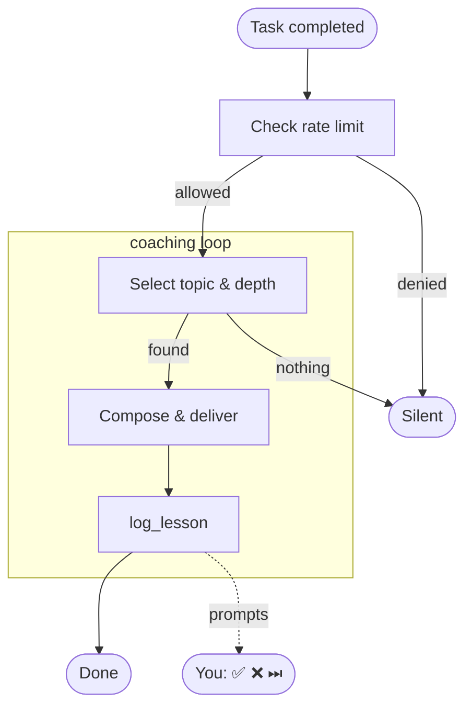

# How it works

devcoach is a silent technical coach that hooks into every Claude response.
The diagrams below show the three main flows: session startup, the coaching loop,
and how a lesson topic is selected.

---

## Session startup

At the start of each Claude session devcoach checks whether the user is set up,
loads prior coaching context, and primes lesson selection before any task is done.

---

## Coaching loop

After every technical task Claude evaluates whether to deliver a lesson.
The loop is silent when nothing is worth teaching or when the rate limit is reached.

---

## Lesson selection

When a teachable concept is found, devcoach walks this priority list from top to bottom
and picks the first match. Depth is then calibrated to the per-topic confidence score.

| Priority | Trigger | Condition |
|:---:|---|---|
| ① | Notebook follow-up | The coaching notebook flagged an angle relevant to the current task |
| ② | Profile pitfall | A pitfall committed or avoided on a profile topic |
| ③ | Profile pattern | An interesting pattern on a profile topic worth formalising |
| ④ | Off-profile pitfall | A pitfall on a topic prominent in the task but absent from the profile |
| ⑤ | Knowledge gap | A profile topic with confidence < 5 |
| ⑥ | Deep-dive | A profile topic at confidence 4–6, not yet mastered |

First match wins. No match → silent.

---

## Depth calibration

The lesson level is determined by the confidence score for the **specific topic being taught**,
adjusted by observations in the coaching notebook.

| Confidence | Level | Lesson angle |
|---|---|---|
| 0 – 3 | Junior | Introduce correct practice, explain from scratch, use analogies |
| 4 – 6 | Mid | Explain the why, mention trade-offs and alternatives |
| 7 – 9 | Senior | Edge cases, historical context, architectural implications |
| 10 | Cutting-edge | Latest developments — ignores level floor and taught-topics filter |
