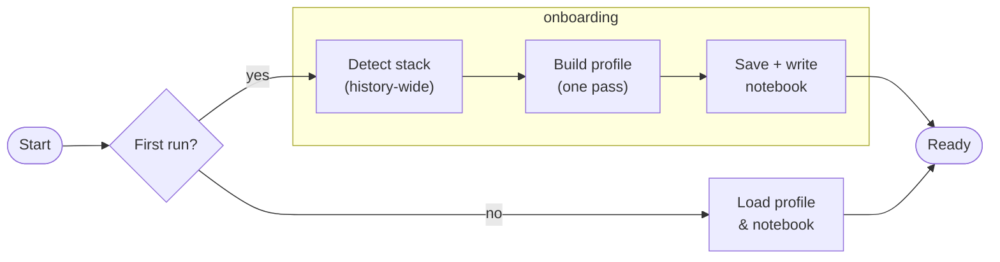
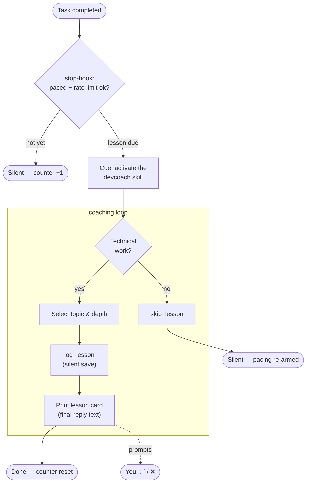

# How it works

devcoach is a silent technical coach that hooks into every Claude response.
The diagrams below show the three main flows: session startup, the coaching loop,
and how a lesson topic is selected.

---

## Session startup

At the start of each Claude session devcoach checks whether the user is set up and loads prior
coaching context. On a first run it builds the profile in one pass from the stack detected across
the whole local Claude Code history, saves it, and writes the coaching notebook — no questions asked.

```mermaid
flowchart LR
    A([Start]) --> B{First run?}
    B -- yes --> C["Detect stack<br/>(history-wide)"]
    C --> D["Build profile<br/>(one pass)"]
    D --> E["Save + write<br/>notebook"]
    B -- no --> F["Load profile<br/>& notebook"]
    E & F --> G([Ready])

    subgraph onboarding["onboarding"]
        C
        D
        E
    end
```

---

## Coaching loop

The loop is driven by two Claude Code hooks. `prompt-hook` (UserPromptSubmit) peeks at
the pacing state read-only and, when the stop at the end of this turn will reach the
threshold, primes the model invisibly so the lesson lands naturally at the bottom of the
reply. `stop-hook` (Stop) owns the pacing counter — `nudge_every` interactions (default 10),
counted per chat session unless `nudge_scope` is `global` — plus the rate limit, and is the
enforcement: when a lesson is due but wasn't delivered, it cues the model — which either
activates the devcoach skill and delivers ONE lesson, or declines explicitly via
`skip_lesson` (re-arming the pacing) when the turn wasn't technical. The loop is silent
between cues, in plan mode (those turns don't count), and while rate-limited (turns keep
accumulating).

```mermaid
flowchart TD
    A([Task completed]) --> B{"stop-hook:<br/>paced + rate limit ok?"}
    B -->|not yet| Z([Silent — counter +1])
    B -->|lesson due| C["Cue: activate the<br/>devcoach skill"]

    subgraph loop["coaching loop"]
        D{"Technical<br/>work?"}
        E[Select topic & depth]
        G["log_lesson<br/>(silent save)"]
        F["Print lesson card<br/>(final reply text)"]
        S[skip_lesson]
    end

    C --> D
    D -->|no| S --> Z2([Silent — pacing re-armed])
    D -->|yes| E --> G --> F
    F --> H([Done — counter reset])
    F -.->|prompts| U(["You: ✅ / ❌"])
```

If a cue goes unresolved (no `log_lesson`, no `skip_lesson`), the next cue arrives after
`min(3, nudge_every)` further stops instead of the full threshold. The pre-lesson context
(onboarding status, rate limit, taught topics, profile, notebook) arrives in ONE silent
`devcoach://briefing` read. The card is printed exactly once, as the final text of the
reply: `log_lesson` is a pure save whose result deliberately does not echo the card —
instead it carries a `reply_check` self-check reminding the model that tool arguments are
invisible to you and that the card must be written out as the final reply. Every tenth
lesson is a notebook checkpoint: the cue says so, and the model updates the coaching
notebook (`~/.devcoach/learning-state.md`) with a direct file write.

---

## Lesson selection

When a teachable concept is found, devcoach walks this priority list from top to bottom
and picks the first match. Depth is then calibrated to the per-topic confidence score.

| Priority | Trigger | Condition |
|:---:|---|---|
| ① | Notebook follow-up | The coaching notebook flagged an angle relevant to the current task |
| ② | Profile pitfall | A pitfall committed or avoided on a profile topic |
| ③ | Profile pattern | An interesting pattern on a profile topic worth formalising |
| ④ | Off-profile pitfall | A pitfall on a topic prominent in the task but absent from the profile |
| ⑤ | Knowledge gap | A profile topic with confidence < 5 |
| ⑥ | Deep-dive | A profile topic at confidence 4–6, not yet mastered |

First match wins. No match → silent.

---

## Depth calibration

The lesson level is determined by the confidence score for the **specific topic being taught**,
adjusted by observations in the coaching notebook.

| Confidence | Level | Lesson angle |
|---|---|---|
| 0 – 3 | Junior | Introduce correct practice, explain from scratch, use analogies |
| 4 – 6 | Mid | Explain the why, mention trade-offs and alternatives |
| 7 – 9 | Senior | Edge cases, historical context, architectural implications |
| 10 | Cutting-edge | Latest developments — ignores level floor and taught-topics filter |

Both the priority list and these bands are defined by the devcoach skill (`SKILL.md` + its
references), which the MCP server also serves as the `devcoach_instructions` prompt.
