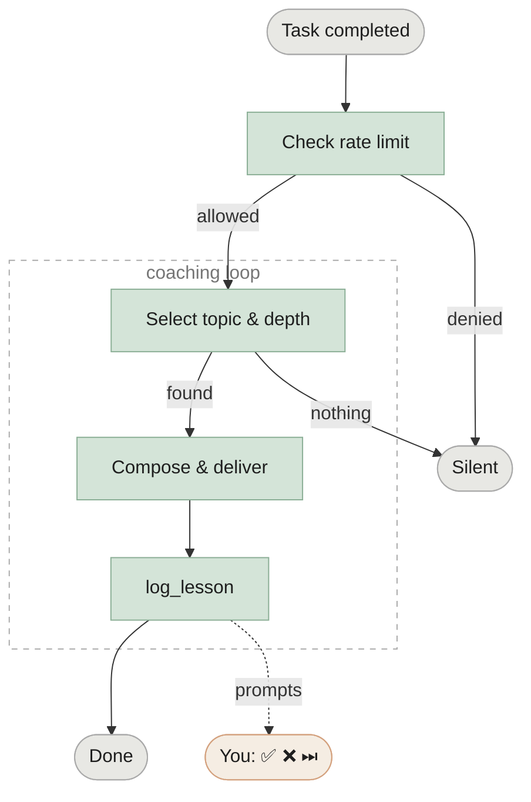

# devcoach

**Progressive technical coaching, directly in Claude.** After every task you complete with Claude Code or Claude Desktop, devcoach delivers a short, targeted lesson based on what you already know — no generic tutorials, no repeated topics.

Everything runs **locally**. No data leaves your machine. One SQLite file at `~/.devcoach/coaching.db`.

---

## How it works



→ [Full decision flow: session startup · lesson selection · depth calibration](how-it-works.md)

---

## Screenshots

### Knowledge map

=== "Dark"
    

=== "Light"
    

### Lesson history

=== "Dark"
    

=== "Light"
    

### Settings

=== "Dark"
    

=== "Light"
    

### Lesson detail

=== "Dark"
    

=== "Light"
    

---

## Quick install

```bash
uv tool install devcoach
devcoach install   # registers with Claude Code / Claude Desktop
```

Restart Claude and you're ready. See [Getting started](getting-started.md) for the full onboarding walkthrough.
