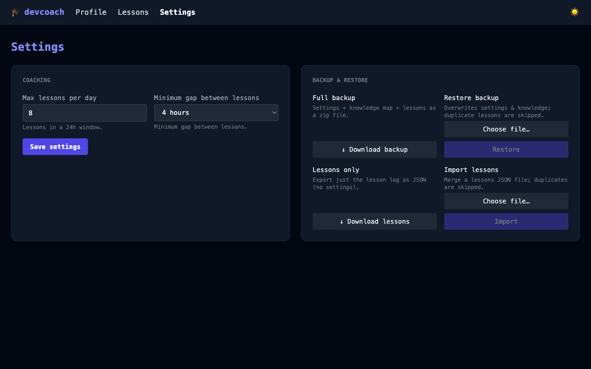
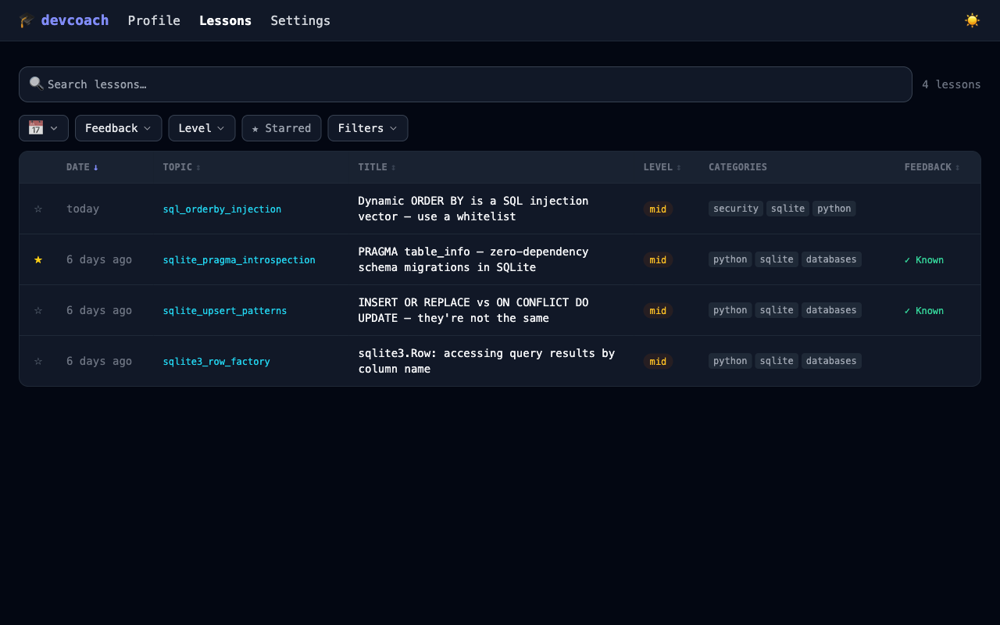

# devcoach

**Progressive technical coaching, directly in Claude.** After every task you complete with Claude Code or Claude Desktop, devcoach delivers a short, targeted lesson based on what you already know — no generic tutorials, no repeated topics.

Everything runs **locally**. No data leaves your machine. One SQLite file at `~/.devcoach/coaching.db`.

---

## How it works

| Step | What happens |
|------|-------------|
| You complete a task with Claude | Claude finishes the work as normal |
| devcoach checks your knowledge map | Finds a topic where you have room to grow, related to what you just did |
| A lesson appears at the end of the response | Calibrated to your level (junior / mid / senior), never repeated |
| You mark it know / don't know | Confidence scores update, shaping future lessons |

---

## Screenshots

### Knowledge map



### Lesson history



### Settings


---

## Quick install

```bash
uv tool install devcoach
devcoach install   # registers with Claude Code / Claude Desktop
```

Restart Claude and you're ready. See [Getting started](getting-started.md) for the full onboarding walkthrough.
