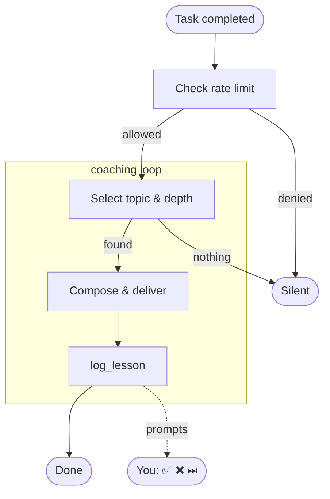

import Tabs from "@theme/Tabs";
import TabItem from "@theme/TabItem";

# devcoach

**Progressive technical coaching, directly in your AI agent.** After every task you complete with
Claude Code, Claude Desktop, or another MCP-compatible agent, devcoach delivers a short, targeted
lesson based on what you already know — no generic tutorials, no repeated topics.

Everything runs **locally**. No data leaves your machine. One SQLite file at `~/.devcoach/coaching.db`.

---

## How it works



→ [Full decision flow: session startup · lesson selection · depth calibration](./how-it-works.md)

---

## Screenshots

### Knowledge map

<Tabs groupId="theme">
  <TabItem value="dark" label="Dark" default>
    
  </TabItem>
  <TabItem value="light" label="Light">
    
  </TabItem>
</Tabs>

### Lesson history

<Tabs groupId="theme">
  <TabItem value="dark" label="Dark" default>
    
  </TabItem>
  <TabItem value="light" label="Light">
    
  </TabItem>
</Tabs>

### Settings

<Tabs groupId="theme">
  <TabItem value="dark" label="Dark" default>
    
  </TabItem>
  <TabItem value="light" label="Light">
    
  </TabItem>
</Tabs>

### Lesson detail

<Tabs groupId="theme">
  <TabItem value="dark" label="Dark" default>
    
  </TabItem>
  <TabItem value="light" label="Light">
    
  </TabItem>
</Tabs>

---

## Quick install

```bash
npx -y devcoach install   # registers with Claude Code / Claude Desktop
```

Requires Node.js ≥ 24. Restart Claude and you're ready. See [Getting started](./getting-started.md)
for the full onboarding walkthrough.
